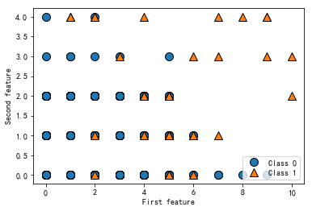

# 拉格朗日插值
knn回归模型的优点之一是模型很容易理解，通常不需要过多的调参就可以得到不错的性能，并且构建模型的速度通常很快。但是使用knn算法时，对数据进行预处理是很重要的，对特征很多的数据集、对于大多数特征值都为0的数据集，效果往往不是很好。

虽然k邻近算法很容易理解，但是由于预测速度慢，且不能处理具有很多特征的数据集，所以，在实践中往往不会用到。


```python
%matplotlib inline
```


```python
import sys
print("Python version:", sys.version)

import pandas as pd
print("pandas version:", pd.__version__)

import matplotlib
print("matplotlib version:", matplotlib.__version__)

import numpy as np
print("NumPy version:", np.__version__)

import scipy as sp
print("SciPy version:", sp.__version__)

import IPython
print("IPython version:", IPython.__version__)

import sklearn
print("scikit-learn version:", sklearn.__version__)

import imblearn
print("imbanlced-learn version:",imblearn.__version__)
```

    Python version: 3.7.9 (default, Aug 31 2020, 17:10:11) [MSC v.1916 64 bit (AMD64)]
    pandas version: 1.1.3
    matplotlib version: 3.3.2
    NumPy version: 1.17.0
    SciPy version: 1.6.2
    IPython version: 7.19.0
    scikit-learn version: 0.24.1
    imbanlced-learn version: 0.8.0


```python
import pandas as pd #导入数据分析库Pandas
import numpy as np
import matplotlib.pyplot as plt
import matplotlib

#指定默认字体
#matplotlib.rcParams['font.sans-serif'] = ['SimHei']
#matplotlib.rcParams['font.family']='sans-serif'
#matplotlib.rcParams['font.size']=14

plt.rc('figure', figsize=(10, 10))

font_options={'sans-serif':'SimHei','family':'sans-serif','weight':'bold','size':20}
plt.rc('font',**font_options)


#plt.style.use('ggplot') # ggplot是其中一种预设样式,会使用R的同学应该非常熟悉

#print(plt.style.available) # 查看所有预设样式
#from scipy.interpolate import lagrange #导入拉格朗日插值函数

```


```python
inputfile = '../data/missing_data.xls' #输入数据路径,需要使用Excel格式；
outputfile = '../tmp/missing_data_processed.xls' #输出数据路径,需要使用Excel格式
data = pd.read_excel(inputfile, header=None) #读入数据
```


```python
data
```


<table border="1" class="dataframe">
  <thead>
    <tr style="text-align: right;">
      <th></th>
      <th>0</th>
      <th>1</th>
      <th>2</th>
    </tr>
  </thead>
  <tbody>
    <tr>
      <th>0</th>
      <td>235.8333</td>
      <td>324.0343</td>
      <td>478.3231</td>
    </tr>
    <tr>
      <th>1</th>
      <td>236.2708</td>
      <td>325.6379</td>
      <td>515.4564</td>
    </tr>
    <tr>
      <th>2</th>
      <td>238.0521</td>
      <td>328.0897</td>
      <td>517.0909</td>
    </tr>
    <tr>
      <th>3</th>
      <td>235.9063</td>
      <td>NaN</td>
      <td>514.8900</td>
    </tr>
    <tr>
      <th>4</th>
      <td>236.7604</td>
      <td>268.8324</td>
      <td>NaN</td>
    </tr>
    <tr>
      <th>5</th>
      <td>NaN</td>
      <td>404.0480</td>
      <td>486.0912</td>
    </tr>
    <tr>
      <th>6</th>
      <td>237.4167</td>
      <td>391.2652</td>
      <td>516.2330</td>
    </tr>
    <tr>
      <th>7</th>
      <td>238.6563</td>
      <td>380.8241</td>
      <td>NaN</td>
    </tr>
    <tr>
      <th>8</th>
      <td>237.6042</td>
      <td>388.0230</td>
      <td>435.3508</td>
    </tr>
    <tr>
      <th>9</th>
      <td>238.0313</td>
      <td>206.4349</td>
      <td>487.6750</td>
    </tr>
    <tr>
      <th>10</th>
      <td>235.0729</td>
      <td>NaN</td>
      <td>NaN</td>
    </tr>
    <tr>
      <th>11</th>
      <td>235.5313</td>
      <td>400.0787</td>
      <td>660.2347</td>
    </tr>
    <tr>
      <th>12</th>
      <td>NaN</td>
      <td>411.2069</td>
      <td>621.2346</td>
    </tr>
    <tr>
      <th>13</th>
      <td>234.4688</td>
      <td>395.2343</td>
      <td>611.3408</td>
    </tr>
    <tr>
      <th>14</th>
      <td>235.5000</td>
      <td>344.8221</td>
      <td>643.0863</td>
    </tr>
    <tr>
      <th>15</th>
      <td>235.6354</td>
      <td>385.6432</td>
      <td>642.3482</td>
    </tr>
    <tr>
      <th>16</th>
      <td>234.5521</td>
      <td>401.6234</td>
      <td>NaN</td>
    </tr>
    <tr>
      <th>17</th>
      <td>236.0000</td>
      <td>409.6489</td>
      <td>602.9347</td>
    </tr>
    <tr>
      <th>18</th>
      <td>235.2396</td>
      <td>416.8795</td>
      <td>589.3457</td>
    </tr>
    <tr>
      <th>19</th>
      <td>235.4896</td>
      <td>NaN</td>
      <td>556.3452</td>
    </tr>
    <tr>
      <th>20</th>
      <td>236.9688</td>
      <td>NaN</td>
      <td>538.3470</td>
    </tr>
  </tbody>
</table>
</div>


```python
#拉格朗日插值代码
md_data=data.interpolate()
md_data
```


<div>
<style scoped>
    .dataframe tbody tr th:only-of-type {
        vertical-align: middle;
    }

    .dataframe tbody tr th {
        vertical-align: top;
    }
    
    .dataframe thead th {
        text-align: right;
    }
</style>

<table border="1" class="dataframe">
  <thead>
    <tr style="text-align: right;">
      <th></th>
      <th>0</th>
      <th>1</th>
      <th>2</th>
    </tr>
  </thead>
  <tbody>
    <tr>
      <th>0</th>
      <td>235.83330</td>
      <td>324.03430</td>
      <td>478.32310</td>
    </tr>
    <tr>
      <th>1</th>
      <td>236.27080</td>
      <td>325.63790</td>
      <td>515.45640</td>
    </tr>
    <tr>
      <th>2</th>
      <td>238.05210</td>
      <td>328.08970</td>
      <td>517.09090</td>
    </tr>
    <tr>
      <th>3</th>
      <td>235.90630</td>
      <td>298.46105</td>
      <td>514.89000</td>
    </tr>
    <tr>
      <th>4</th>
      <td>236.76040</td>
      <td>268.83240</td>
      <td>500.49060</td>
    </tr>
    <tr>
      <th>5</th>
      <td>237.08855</td>
      <td>404.04800</td>
      <td>486.09120</td>
    </tr>
    <tr>
      <th>6</th>
      <td>237.41670</td>
      <td>391.26520</td>
      <td>516.23300</td>
    </tr>
    <tr>
      <th>7</th>
      <td>238.65630</td>
      <td>380.82410</td>
      <td>475.79190</td>
    </tr>
    <tr>
      <th>8</th>
      <td>237.60420</td>
      <td>388.02300</td>
      <td>435.35080</td>
    </tr>
    <tr>
      <th>9</th>
      <td>238.03130</td>
      <td>206.43490</td>
      <td>487.67500</td>
    </tr>
    <tr>
      <th>10</th>
      <td>235.07290</td>
      <td>303.25680</td>
      <td>573.95485</td>
    </tr>
    <tr>
      <th>11</th>
      <td>235.53130</td>
      <td>400.07870</td>
      <td>660.23470</td>
    </tr>
    <tr>
      <th>12</th>
      <td>235.00005</td>
      <td>411.20690</td>
      <td>621.23460</td>
    </tr>
    <tr>
      <th>13</th>
      <td>234.46880</td>
      <td>395.23430</td>
      <td>611.34080</td>
    </tr>
    <tr>
      <th>14</th>
      <td>235.50000</td>
      <td>344.82210</td>
      <td>643.08630</td>
    </tr>
    <tr>
      <th>15</th>
      <td>235.63540</td>
      <td>385.64320</td>
      <td>642.34820</td>
    </tr>
    <tr>
      <th>16</th>
      <td>234.55210</td>
      <td>401.62340</td>
      <td>622.64145</td>
    </tr>
    <tr>
      <th>17</th>
      <td>236.00000</td>
      <td>409.64890</td>
      <td>602.93470</td>
    </tr>
    <tr>
      <th>18</th>
      <td>235.23960</td>
      <td>416.87950</td>
      <td>589.34570</td>
    </tr>
    <tr>
      <th>19</th>
      <td>235.48960</td>
      <td>416.87950</td>
      <td>556.34520</td>
    </tr>
    <tr>
      <th>20</th>
      <td>236.96880</td>
      <td>416.87950</td>
      <td>538.34700</td>
    </tr>
  </tbody>
</table>
</div>


```python
#输出结果
md_data.to_excel(outputfile,header=None,index=False)
```

# 模型构建
观察数据


```python
from mglearn import plot_helpers
```


```python
#构建CART决策树模型
from sklearn.tree import DecisionTreeClassifier #导入决策树模型
```


```python
import matplotlib.pyplot as plt
```


```python
datafile = '../data/model.xls' #数据名
data = pd.read_excel(datafile) #读取数据，数据的前三列是特征，第四列是标签
```


```python
#对各个指标一次统计
data.apply(pd.value_counts)
```


<div>
<style scoped>
    .dataframe tbody tr th:only-of-type {
        vertical-align: middle;
    }

    .dataframe tbody tr th {
        vertical-align: top;
    }
    
    .dataframe thead th {
        text-align: right;
    }
</style>

<table border="1" class="dataframe">
  <thead>
    <tr style="text-align: right;">
      <th></th>
      <th>电量趋势下降指标</th>
      <th>线损指标</th>
      <th>告警类指标</th>
      <th>是否窃漏电</th>
    </tr>
  </thead>
  <tbody>
    <tr>
      <th>0</th>
      <td>50</td>
      <td>142.0</td>
      <td>100.0</td>
      <td>251.0</td>
    </tr>
    <tr>
      <th>1</th>
      <td>44</td>
      <td>149.0</td>
      <td>74.0</td>
      <td>40.0</td>
    </tr>
    <tr>
      <th>2</th>
      <td>48</td>
      <td>NaN</td>
      <td>95.0</td>
      <td>NaN</td>
    </tr>
    <tr>
      <th>3</th>
      <td>47</td>
      <td>NaN</td>
      <td>11.0</td>
      <td>NaN</td>
    </tr>
    <tr>
      <th>4</th>
      <td>50</td>
      <td>NaN</td>
      <td>11.0</td>
      <td>NaN</td>
    </tr>
    <tr>
      <th>5</th>
      <td>31</td>
      <td>NaN</td>
      <td>NaN</td>
      <td>NaN</td>
    </tr>
    <tr>
      <th>6</th>
      <td>8</td>
      <td>NaN</td>
      <td>NaN</td>
      <td>NaN</td>
    </tr>
    <tr>
      <th>7</th>
      <td>5</td>
      <td>NaN</td>
      <td>NaN</td>
      <td>NaN</td>
    </tr>
    <tr>
      <th>8</th>
      <td>2</td>
      <td>NaN</td>
      <td>NaN</td>
      <td>NaN</td>
    </tr>
    <tr>
      <th>9</th>
      <td>4</td>
      <td>NaN</td>
      <td>NaN</td>
      <td>NaN</td>
    </tr>
    <tr>
      <th>10</th>
      <td>2</td>
      <td>NaN</td>
      <td>NaN</td>
      <td>NaN</td>
    </tr>
  </tbody>
</table>
电量趋势下降指标线损指标告警类指标是否窃漏电050142.0100.0251.0144149.074.040.0248NaN95.0NaN347NaN11.0NaN450NaN11.0NaN531NaNNaNNaN68NaNNaNNaN75NaNNaNNaN82NaNNaNNaN94NaNNaNNaN102NaNNaNNaN

电量趋势下降指标线损指标告警类指标是否窃漏电02512512511404040


```python
data.head()
```


<div>
<style scoped>
    .dataframe tbody tr th:only-of-type {
        vertical-align: middle;
    }

    .dataframe tbody tr th {
        vertical-align: top;
    }
    
    .dataframe thead th {
        text-align: right;
    }
</style>
<table border="1" class="dataframe">
  <thead>
    <tr style="text-align: right;">
      <th></th>
      <th>电量趋势下降指标</th>
      <th>线损指标</th>
      <th>告警类指标</th>
      <th>是否窃漏电</th>
    </tr>
  </thead>
  <tbody>
    <tr>
      <th>0</th>
      <td>4</td>
      <td>1</td>
      <td>1</td>
      <td>1</td>
    </tr>
    <tr>
      <th>1</th>
      <td>4</td>
      <td>0</td>
      <td>4</td>
      <td>1</td>
    </tr>
    <tr>
      <th>2</th>
      <td>2</td>
      <td>1</td>
      <td>1</td>
      <td>1</td>
    </tr>
    <tr>
      <th>3</th>
      <td>9</td>
      <td>0</td>
      <td>0</td>
      <td>0</td>
    </tr>
    <tr>
      <th>4</th>
      <td>3</td>
      <td>1</td>
      <td>0</td>
      <td>0</td>
    </tr>
  </tbody>
</table>
</div>


```python
data.iloc[:,3:4].head()
```


<div>
<style scoped>
    .dataframe tbody tr th:only-of-type {
        vertical-align: middle;
    }

    .dataframe tbody tr th {
        vertical-align: top;
    }
    
    .dataframe thead th {
        text-align: right;
    }
</style>

<table border="1" class="dataframe">
  <thead>
    <tr style="text-align: right;">
      <th></th>
      <th>是否窃漏电</th>
    </tr>
  </thead>
  <tbody>
    <tr>
      <th>0</th>
      <td>1</td>
    </tr>
    <tr>
      <th>1</th>
      <td>1</td>
    </tr>
    <tr>
      <th>2</th>
      <td>1</td>
    </tr>
    <tr>
      <th>3</th>
      <td>0</td>
    </tr>
    <tr>
      <th>4</th>
      <td>0</td>
    </tr>
  </tbody>
</table>
</div>


```python
data.describe()
```


<div>
<style scoped>
    .dataframe tbody tr th:only-of-type {
        vertical-align: middle;
    }

    .dataframe tbody tr th {
        vertical-align: top;
    }
    
    .dataframe thead th {
        text-align: right;
    }
</style>

<table border="1" class="dataframe">
  <thead>
    <tr style="text-align: right;">
      <th></th>
        <th>电量趋势下降指标</th>
        <th>线损指标</th>
        <th>告警类指标</th>
        <th>是否窃漏电</th>
    </tr>
  </thead>
  <tbody style="text-align: right;">
    <tr>
      <th>count</th>
      <td>291.000000</td>
      <td>291.000000</td>
      <td>291.000000</td>
      <td>291.000000</td>
    </tr>
    <tr>
      <th>mean</th>
      <td>2.718213</td>
      <td>0.512027</td>
      <td>1.171821</td>
      <td>0.137457</td>
    </tr>
    <tr>
      <th>std</th>
      <td>2.091768</td>
      <td>0.500716</td>
      <td>1.065783</td>
      <td>0.344922</td>
    </tr>
    <tr>
      <th>min</th>
      <td>0.000000</td>
      <td>0.000000</td>
      <td>0.000000</td>
      <td>0.000000</td>
    </tr>
    <tr>
      <th>25%</th>
      <td>1.000000</td>
      <td>0.000000</td>
      <td>0.000000</td>
      <td>0.000000</td>
    </tr>
    <tr>
      <th>50%</th>
      <td>3.000000</td>
      <td>1.000000</td>
      <td>1.000000</td>
      <td>0.000000</td>
    </tr>
    <tr>
      <th>75%</th>
      <td>4.000000</td>
      <td>1.000000</td>
      <td>2.000000</td>
      <td>0.000000</td>
    </tr>
    <tr>
      <th>max</th>
      <td>10.000000</td>
      <td>1.000000</td>
      <td>4.000000</td>
      <td>1.000000</td>
    </tr>
  </tbody>
</table>

</div>


```python
list(data.columns)
data.sum()
```


    电量趋势下降指标    791
    线损指标        149
    告警类指标       341
    是否窃漏电        40
    dtype: int64


```python
data[data.columns[3]].value_counts()
```


    0    251
    1     40
    Name: 是否窃漏电, dtype: int64


```python
data_group=data.groupby(list(data.columns)[3])
data_group.count()
```


<div>
<style scoped>
    .dataframe tbody tr th:only-of-type {
        vertical-align: middle;
    }

    .dataframe tbody tr th {
        vertical-align: top;
    }
    
    .dataframe thead th {
        text-align: right;
    }
</style>

<table border="1" class="dataframe" style="text-align: right;">
  <thead>
    <tr >
      <th>是否窃漏电</th>
      <th>电量趋势下降指标</th>
      <th>线损指标</th>
      <th>告警类指标</th>
    </tr>
  </thead>
  <tbody>
    <tr>
      <th>0</th>
      <td>251</td>
      <td>251</td>
      <td>251</td>
    </tr>
    <tr>
      <th>1</th>
      <td>40</td>
      <td>40</td>
      <td>40</td>
    </tr>
  </tbody>
</table>

</div>


Basic Plotting: plot
See the cookbook for some advanced strategies

The plot method on Series and DataFrame is just a simple wrapper around plt.plot():

``df.plot(kind='line')`` is equivalent to ``df.plot.line()``

Other Plots
The kind keyword argument of plot() accepts a handful of values for plots other than the default Line plot. These include:

‘bar’ or ‘barh’ for bar plots
‘hist’ for histogram
‘box’ for boxplot
‘kde’ or 'density' for density plots
‘area’ for area plots
‘scatter’ for scatter plots
‘hexbin’ for hexagonal bin plots
‘pie’ for pie plots
In addition to these kind s, there are the DataFrame.hist(), and DataFrame.boxplot() methods, which use a separate interface.

Finally, there are several plotting functions in pandas.tools.plotting that take a Series or DataFrame as an argument. These include

Scatter Matrix
Andrews Curves
Parallel Coordinates
Lag Plot
Autocorrelation Plot
Bootstrap Plot
RadViz
Plots may also be adorned with errorbars or tables.


```python
#data.plot.scatter(x='电量趋势下降指标',y='是否窃漏电',c='DarkBlue')
data.plot.scatter(x=list(data.columns)[0],y=list(data.columns)[2],c='DarkBlue')
```


    <matplotlib.axes._subplots.AxesSubplot at 0x16bd2ca00b8>


    


```python
# plot dataset
plot_helpers.discrete_scatter(data.iloc[1:, 0], data.iloc[1:, 2], data.iloc[1:,3])
plt.legend(["Class 0", "Class 1"], loc=4)
plt.xlabel("First feature")
plt.ylabel("Second feature")
print("data[:,:3]].shape:", data.iloc[1:,:3].shape)
```

    data[:,:3]].shape: (290, 3)



    


```python
data.plot(kind='hist',alpha=0.5)#与data.plot.hist(alpha=05)造价
```


    <matplotlib.axes._subplots.AxesSubplot at 0x1d52da54c18>


   
​    


```python
data.hist(figsize=(15,10))#分开绘图
```


    array([[<matplotlib.axes._subplots.AxesSubplot object at 0x000001D52CFB8A90>,
            <matplotlib.axes._subplots.AxesSubplot object at 0x000001D52DB4A4E0>],
           [<matplotlib.axes._subplots.AxesSubplot object at 0x000001D52E06F978>,
            <matplotlib.axes._subplots.AxesSubplot object at 0x000001D52E092EB8>]],
          dtype=object)

  


​    


```python
data.plot()
```


    <matplotlib.axes._subplots.AxesSubplot at 0x2148b9d9160>


​    


```python
pd.plotting.scatter_matrix(data,figsize=(20,20),alpha=0.2)
```


    array([[<matplotlib.axes._subplots.AxesSubplot object at 0x0000021489E34C50>,
            <matplotlib.axes._subplots.AxesSubplot object at 0x0000021489EADDA0>,
            <matplotlib.axes._subplots.AxesSubplot object at 0x000002148B5BF198>,
            <matplotlib.axes._subplots.AxesSubplot object at 0x000002148B5E66D8>],
           [<matplotlib.axes._subplots.AxesSubplot object at 0x000002148B60DC50>,
            <matplotlib.axes._subplots.AxesSubplot object at 0x000002148B63F208>,
            <matplotlib.axes._subplots.AxesSubplot object at 0x000002148B667780>,
            <matplotlib.axes._subplots.AxesSubplot object at 0x000002148B690D30>],
           [<matplotlib.axes._subplots.AxesSubplot object at 0x000002148B690D68>,
            <matplotlib.axes._subplots.AxesSubplot object at 0x000002148B6E8828>,
            <matplotlib.axes._subplots.AxesSubplot object at 0x000002148B712DA0>,
            <matplotlib.axes._subplots.AxesSubplot object at 0x000002148B743358>],
           [<matplotlib.axes._subplots.AxesSubplot object at 0x000002148B7698D0>,
            <matplotlib.axes._subplots.AxesSubplot object at 0x000002148B792E48>,
            <matplotlib.axes._subplots.AxesSubplot object at 0x000002148B7C2400>,
            <matplotlib.axes._subplots.AxesSubplot object at 0x000002148B7EA978>]],
          dtype=object)


​    


构建KNN模型


```python
#data[[list(data.columns)[0],list(data.columns)[2]]]=data[[list(data.columns)[0],list(data.columns)[2]]].astype(str)
data_dummies=pd.get_dummies(data,columns=[list(data.columns)[0],list(data.columns)[2]])
data_dummies
```


<div>
<style scoped>
    .dataframe tbody tr th:only-of-type {
        vertical-align: middle;
    }

    .dataframe tbody tr th {
        vertical-align: top;
    }
    
    .dataframe thead th {
        text-align: right;
    }
</style>
<table border="1" class="dataframe">
  <thead>
    <tr style="text-align: right;">
      <th></th>
      <th>线损指标</th>
      <th>是否窃漏电</th>
      <th>电量趋势下降指标_0</th>
      <th>电量趋势下降指标_1</th>
      <th>电量趋势下降指标_2</th>
      <th>电量趋势下降指标_3</th>
      <th>电量趋势下降指标_4</th>
      <th>电量趋势下降指标_5</th>
      <th>电量趋势下降指标_6</th>
      <th>电量趋势下降指标_7</th>
      <th>电量趋势下降指标_8</th>
      <th>电量趋势下降指标_9</th>
      <th>电量趋势下降指标_10</th>
      <th>告警类指标_0</th>
      <th>告警类指标_1</th>
      <th>告警类指标_2</th>
      <th>告警类指标_3</th>
      <th>告警类指标_4</th>
    </tr>
  </thead>
  <tbody>
    <tr>
      <th>0</th>
      <td>1</td>
      <td>1</td>
      <td>0</td>
      <td>0</td>
      <td>0</td>
      <td>0</td>
      <td>1</td>
      <td>0</td>
      <td>0</td>
      <td>0</td>
      <td>0</td>
      <td>0</td>
      <td>0</td>
      <td>0</td>
      <td>1</td>
      <td>0</td>
      <td>0</td>
      <td>0</td>
    </tr>
    <tr>
      <th>1</th>
      <td>0</td>
      <td>1</td>
      <td>0</td>
      <td>0</td>
      <td>0</td>
      <td>0</td>
      <td>1</td>
      <td>0</td>
      <td>0</td>
      <td>0</td>
      <td>0</td>
      <td>0</td>
      <td>0</td>
      <td>0</td>
      <td>0</td>
      <td>0</td>
      <td>0</td>
      <td>1</td>
    </tr>
    <tr>
      <th>2</th>
      <td>1</td>
      <td>1</td>
      <td>0</td>
      <td>0</td>
      <td>1</td>
      <td>0</td>
      <td>0</td>
      <td>0</td>
      <td>0</td>
      <td>0</td>
      <td>0</td>
      <td>0</td>
      <td>0</td>
      <td>0</td>
      <td>1</td>
      <td>0</td>
      <td>0</td>
      <td>0</td>
    </tr>
    <tr>
      <th>3</th>
      <td>0</td>
      <td>0</td>
      <td>0</td>
      <td>0</td>
      <td>0</td>
      <td>0</td>
      <td>0</td>
      <td>0</td>
      <td>0</td>
      <td>0</td>
      <td>0</td>
      <td>1</td>
      <td>0</td>
      <td>1</td>
      <td>0</td>
      <td>0</td>
      <td>0</td>
      <td>0</td>
    </tr>
    <tr>
      <th>4</th>
      <td>1</td>
      <td>0</td>
      <td>0</td>
      <td>0</td>
      <td>0</td>
      <td>1</td>
      <td>0</td>
      <td>0</td>
      <td>0</td>
      <td>0</td>
      <td>0</td>
      <td>0</td>
      <td>0</td>
      <td>1</td>
      <td>0</td>
      <td>0</td>
      <td>0</td>
      <td>0</td>
    </tr>
    <tr>
      <th>...</th>
      <td>...</td>
      <td>...</td>
      <td>...</td>
      <td>...</td>
      <td>...</td>
      <td>...</td>
      <td>...</td>
      <td>...</td>
      <td>...</td>
      <td>...</td>
      <td>...</td>
      <td>...</td>
      <td>...</td>
      <td>...</td>
      <td>...</td>
      <td>...</td>
      <td>...</td>
      <td>...</td>
    </tr>
    <tr>
      <th>286</th>
      <td>1</td>
      <td>0</td>
      <td>0</td>
      <td>0</td>
      <td>0</td>
      <td>0</td>
      <td>1</td>
      <td>0</td>
      <td>0</td>
      <td>0</td>
      <td>0</td>
      <td>0</td>
      <td>0</td>
      <td>0</td>
      <td>0</td>
      <td>1</td>
      <td>0</td>
      <td>0</td>
    </tr>
    <tr>
      <th>287</th>
      <td>0</td>
      <td>0</td>
      <td>0</td>
      <td>1</td>
      <td>0</td>
      <td>0</td>
      <td>0</td>
      <td>0</td>
      <td>0</td>
      <td>0</td>
      <td>0</td>
      <td>0</td>
      <td>0</td>
      <td>0</td>
      <td>0</td>
      <td>1</td>
      <td>0</td>
      <td>0</td>
    </tr>
    <tr>
      <th>288</th>
      <td>1</td>
      <td>1</td>
      <td>0</td>
      <td>0</td>
      <td>0</td>
      <td>0</td>
      <td>0</td>
      <td>1</td>
      <td>0</td>
      <td>0</td>
      <td>0</td>
      <td>0</td>
      <td>0</td>
      <td>0</td>
      <td>0</td>
      <td>1</td>
      <td>0</td>
      <td>0</td>
    </tr>
    <tr>
      <th>289</th>
      <td>1</td>
      <td>0</td>
      <td>0</td>
      <td>0</td>
      <td>1</td>
      <td>0</td>
      <td>0</td>
      <td>0</td>
      <td>0</td>
      <td>0</td>
      <td>0</td>
      <td>0</td>
      <td>0</td>
      <td>1</td>
      <td>0</td>
      <td>0</td>
      <td>0</td>
      <td>0</td>
    </tr>
    <tr>
      <th>290</th>
      <td>1</td>
      <td>0</td>
      <td>0</td>
      <td>0</td>
      <td>0</td>
      <td>0</td>
      <td>1</td>
      <td>0</td>
      <td>0</td>
      <td>0</td>
      <td>0</td>
      <td>0</td>
      <td>0</td>
      <td>1</td>
      <td>0</td>
      <td>0</td>
      <td>0</td>
      <td>0</td>
    </tr>
  </tbody>
</table>
<p>291 rows × 18 columns</p>
</div>


```python
data_dummies_cols=list(data_dummies.columns)
first_col=data_dummies_cols.pop(0)
second_col=data_dummies_cols.pop(0)

data_dummies_cols=data_dummies_cols+[first_col,second_col]

data_dummies_cols
```


    ['电量趋势下降指标_0',
     '电量趋势下降指标_1',
     '电量趋势下降指标_2',
     '电量趋势下降指标_3',
     '电量趋势下降指标_4',
     '电量趋势下降指标_5',
     '电量趋势下降指标_6',
     '电量趋势下降指标_7',
     '电量趋势下降指标_8',
     '电量趋势下降指标_9',
     '电量趋势下降指标_10',
     '告警类指标_0',
     '告警类指标_1',
     '告警类指标_2',
     '告警类指标_3',
     '告警类指标_4',
     '线损指标',
     '是否窃漏电']


```python
data_dummies=data_dummies[data_dummies_cols]#.astype(int)
data_dummies
```


<div>
<style scoped>
    .dataframe tbody tr th:only-of-type {
        vertical-align: middle;
    }

    .dataframe tbody tr th {
        vertical-align: top;
    }
    
    .dataframe thead th {
        text-align: right;
    }
</style>
<table border="1" class="dataframe">
  <thead>
    <tr style="text-align: right;">
      <th></th>
      <th>电量趋势下降指标_0</th>
      <th>电量趋势下降指标_1</th>
      <th>电量趋势下降指标_2</th>
      <th>电量趋势下降指标_3</th>
      <th>电量趋势下降指标_4</th>
      <th>电量趋势下降指标_5</th>
      <th>电量趋势下降指标_6</th>
      <th>电量趋势下降指标_7</th>
      <th>电量趋势下降指标_8</th>
      <th>电量趋势下降指标_9</th>
      <th>电量趋势下降指标_10</th>
      <th>告警类指标_0</th>
      <th>告警类指标_1</th>
      <th>告警类指标_2</th>
      <th>告警类指标_3</th>
      <th>告警类指标_4</th>
      <th>线损指标</th>
      <th>是否窃漏电</th>
    </tr>
  </thead>
  <tbody>
    <tr>
      <th>0</th>
      <td>0</td>
      <td>0</td>
      <td>0</td>
      <td>0</td>
      <td>1</td>
      <td>0</td>
      <td>0</td>
      <td>0</td>
      <td>0</td>
      <td>0</td>
      <td>0</td>
      <td>0</td>
      <td>1</td>
      <td>0</td>
      <td>0</td>
      <td>0</td>
      <td>1</td>
      <td>1</td>
    </tr>
    <tr>
      <th>1</th>
      <td>0</td>
      <td>0</td>
      <td>0</td>
      <td>0</td>
      <td>1</td>
      <td>0</td>
      <td>0</td>
      <td>0</td>
      <td>0</td>
      <td>0</td>
      <td>0</td>
      <td>0</td>
      <td>0</td>
      <td>0</td>
      <td>0</td>
      <td>1</td>
      <td>0</td>
      <td>1</td>
    </tr>
    <tr>
      <th>2</th>
      <td>0</td>
      <td>0</td>
      <td>1</td>
      <td>0</td>
      <td>0</td>
      <td>0</td>
      <td>0</td>
      <td>0</td>
      <td>0</td>
      <td>0</td>
      <td>0</td>
      <td>0</td>
      <td>1</td>
      <td>0</td>
      <td>0</td>
      <td>0</td>
      <td>1</td>
      <td>1</td>
    </tr>
    <tr>
      <th>3</th>
      <td>0</td>
      <td>0</td>
      <td>0</td>
      <td>0</td>
      <td>0</td>
      <td>0</td>
      <td>0</td>
      <td>0</td>
      <td>0</td>
      <td>1</td>
      <td>0</td>
      <td>1</td>
      <td>0</td>
      <td>0</td>
      <td>0</td>
      <td>0</td>
      <td>0</td>
      <td>0</td>
    </tr>
    <tr>
      <th>4</th>
      <td>0</td>
      <td>0</td>
      <td>0</td>
      <td>1</td>
      <td>0</td>
      <td>0</td>
      <td>0</td>
      <td>0</td>
      <td>0</td>
      <td>0</td>
      <td>0</td>
      <td>1</td>
      <td>0</td>
      <td>0</td>
      <td>0</td>
      <td>0</td>
      <td>1</td>
      <td>0</td>
    </tr>
    <tr>
      <th>...</th>
      <td>...</td>
      <td>...</td>
      <td>...</td>
      <td>...</td>
      <td>...</td>
      <td>...</td>
      <td>...</td>
      <td>...</td>
      <td>...</td>
      <td>...</td>
      <td>...</td>
      <td>...</td>
      <td>...</td>
      <td>...</td>
      <td>...</td>
      <td>...</td>
      <td>...</td>
      <td>...</td>
    </tr>
    <tr>
      <th>286</th>
      <td>0</td>
      <td>0</td>
      <td>0</td>
      <td>0</td>
      <td>1</td>
      <td>0</td>
      <td>0</td>
      <td>0</td>
      <td>0</td>
      <td>0</td>
      <td>0</td>
      <td>0</td>
      <td>0</td>
      <td>1</td>
      <td>0</td>
      <td>0</td>
      <td>1</td>
      <td>0</td>
    </tr>
    <tr>
      <th>287</th>
      <td>0</td>
      <td>1</td>
      <td>0</td>
      <td>0</td>
      <td>0</td>
      <td>0</td>
      <td>0</td>
      <td>0</td>
      <td>0</td>
      <td>0</td>
      <td>0</td>
      <td>0</td>
      <td>0</td>
      <td>1</td>
      <td>0</td>
      <td>0</td>
      <td>0</td>
      <td>0</td>
    </tr>
    <tr>
      <th>288</th>
      <td>0</td>
      <td>0</td>
      <td>0</td>
      <td>0</td>
      <td>0</td>
      <td>1</td>
      <td>0</td>
      <td>0</td>
      <td>0</td>
      <td>0</td>
      <td>0</td>
      <td>0</td>
      <td>0</td>
      <td>1</td>
      <td>0</td>
      <td>0</td>
      <td>1</td>
      <td>1</td>
    </tr>
    <tr>
      <th>289</th>
      <td>0</td>
      <td>0</td>
      <td>1</td>
      <td>0</td>
      <td>0</td>
      <td>0</td>
      <td>0</td>
      <td>0</td>
      <td>0</td>
      <td>0</td>
      <td>0</td>
      <td>1</td>
      <td>0</td>
      <td>0</td>
      <td>0</td>
      <td>0</td>
      <td>1</td>
      <td>0</td>
    </tr>
    <tr>
      <th>290</th>
      <td>0</td>
      <td>0</td>
      <td>0</td>
      <td>0</td>
      <td>1</td>
      <td>0</td>
      <td>0</td>
      <td>0</td>
      <td>0</td>
      <td>0</td>
      <td>0</td>
      <td>1</td>
      <td>0</td>
      <td>0</td>
      <td>0</td>
      <td>0</td>
      <td>1</td>
      <td>0</td>
    </tr>
  </tbody>
</table>
<p>291 rows × 18 columns</p>
</div>


```python
data_dummies = data_dummies.values #将表格转换为矩阵
data_dummies
```


    array([[0, 0, 0, ..., 0, 1, 1],
           [0, 0, 0, ..., 1, 0, 1],
           [0, 0, 1, ..., 0, 1, 1],
           ...,
           [0, 0, 0, ..., 0, 1, 1],
           [0, 0, 1, ..., 0, 1, 0],
           [0, 0, 0, ..., 0, 1, 0]], dtype=int64)


```python
data_dummies[:,-1]

```


    array([0, 1, 0, 0, 0, 0, 0, 0, 0, 0, 0, 0, 0, 0, 0, 0, 0, 0, 1, 1, 0, 0,
           0, 0, 0, 0, 0, 1, 0, 0, 1, 0, 0, 0, 1, 0, 0, 0, 0, 0, 0, 0, 0, 0,
           0, 0, 0, 0, 0, 0, 0, 0, 1, 0, 0, 0, 1, 0, 1, 0, 0, 0, 1, 0, 0, 0,
           0, 0, 0, 0, 0, 0, 0, 0, 0, 0, 0, 0, 0, 0, 0, 0, 0, 0, 0, 0, 0, 0,
           0, 0, 0, 0, 0, 0, 0, 0, 0, 0, 0, 0, 0, 0, 0, 0, 0, 0, 0, 0, 0, 0,
           0, 0, 0, 0, 0, 0, 0, 0, 0, 0, 0, 0, 0, 0, 0, 0, 0, 0, 0, 0, 0, 0,
           0, 0, 0, 0, 0, 0, 1, 0, 0, 0, 0, 0, 0, 0, 0, 0, 0, 0, 0, 0, 0, 0,
           0, 0, 0, 0, 0, 0, 0, 0, 0, 0, 0, 0, 0, 0, 0, 0, 0, 0, 0, 0, 0, 0,
           0, 0, 0, 0, 0, 0, 0, 0, 0, 0, 0, 0, 0, 0, 0, 0, 0, 0, 0, 0, 0, 0,
           0, 0, 0, 0, 0, 0, 0, 0, 0, 0, 0, 0, 0, 0, 0, 0, 0, 0, 0, 0, 0, 0,
           0, 0, 0, 0, 0, 0, 0, 0, 0, 0, 0, 0, 0, 0, 0, 0, 0, 0, 0, 0, 0, 0,
           0, 0, 0, 0, 0, 0, 0, 0, 0, 0, 0, 0, 0, 0, 0, 0, 0, 0, 0, 0, 0, 0,
           0, 0, 0, 0, 0, 0, 0, 0, 0, 0, 0, 0, 0, 0, 0, 0, 0, 0, 0, 0, 0, 0,
           0, 0, 0, 0, 0], dtype=int64)


```python
data_dummies.shape[1]
```


    18


```python
from sklearn.model_selection import train_test_split

#train_test_split Parameters
#test_size : float, int or None, optional (default=0.25)
#shuffle : boolean, optional (default=True)
#X_train,X_test,y_train,y_test=train_test_split(data_dummies[:,:data_dummies.shape[1]-1],data_dummies[:,-1],random_state=0)
X_train,X_test,y_train,y_test=train_test_split(data_dummies[:,:-1],data_dummies[:,-1],random_state=60)
```


```python
X_train
```


    array([[1, 0, 0, ..., 0, 0, 0],
           [1, 0, 0, ..., 0, 0, 0],
           [0, 0, 0, ..., 0, 0, 0],
           ...,
           [0, 1, 0, ..., 0, 0, 0],
           [0, 1, 0, ..., 0, 0, 0],
           [0, 0, 0, ..., 0, 1, 0]], dtype=int64)


```python
y_train
```


    array([0, 0, 0, 0, 0, 0, 0, 0, 0, 0, 0, 0, 0, 1, 0, 1, 0, 0, 0, 0, 0, 0,
           0, 0, 0, 0, 0, 0, 0, 0, 0, 0, 0, 0, 0, 1, 0, 0, 0, 0, 1, 0, 0, 0,
           0, 0, 0, 0, 0, 0, 1, 0, 0, 0, 0, 0, 0, 0, 0, 0, 0, 0, 0, 0, 0, 1,
           0, 1, 0, 0, 0, 0, 0, 0, 0, 1, 0, 1, 0, 0, 0, 0, 1, 0, 1, 0, 0, 0,
           0, 0, 0, 0, 0, 1, 0, 0, 0, 0, 0, 0, 0, 1, 0, 0, 0, 0, 0, 0, 0, 1,
           0, 0, 1, 0, 0, 1, 0, 0, 0, 0, 0, 0, 0, 0, 1, 0, 1, 0, 0, 0, 0, 0,
           0, 0, 1, 0, 0, 0, 1, 1, 0, 0, 0, 0, 0, 0, 0, 0, 0, 0, 0, 0, 1, 0,
           0, 0, 0, 0, 0, 1, 0, 0, 0, 1, 0, 0, 0, 0, 0, 0, 0, 1, 0, 0, 0, 1,
           1, 0, 0, 0, 0, 0, 0, 0, 1, 0, 0, 0, 0, 0, 0, 0, 0, 0, 0, 0, 0, 1,
           0, 0, 0, 0, 0, 0, 0, 0, 0, 0, 0, 0, 0, 0, 0, 0, 0, 0, 1, 1],
          dtype=int64)


```python
X_test
```


    array([[0, 0, 0, ..., 1, 0, 0],
           [0, 0, 1, ..., 0, 0, 0],
           [0, 0, 0, ..., 0, 0, 0],
           ...,
           [0, 0, 0, ..., 0, 1, 0],
           [1, 0, 0, ..., 0, 1, 0],
           [1, 0, 0, ..., 1, 0, 0]], dtype=int64)


```python
print("X_train shape:", X_train.shape)
print("y_train shape:", y_train.shape)
print("y_test shape:", y_test.shape)
```

    X_train shape: (218, 17)
    y_train shape: (218,)
    y_test shape: (73,)


Logistic回归从根本上解决因变量要不是连续变量怎么办的问题。自变量既可以是连续的，也可以是分类的。然后通过logistic回归分析，可以得到自变量的权重，从而可以大致了解到底哪些因素是胃癌的危险因素。同时根据该权值可以根据危险因素预测一个人患癌症的可能性。
Logistic回归模型的适用条件
1 因变量为二分类的分类变量或某事件的发生率，并且是数值型变量。但是需要注意，重复计数现象指标不适用于Logistic回归。
2 残差和因变量都要服从二项分布。二项分布对应的是分类变量，所以不是正态分布，进而不是用最小二乘法，而是最大似然法来解决方程估计和检验问题。
3 自变量和Logistic概率是线性关系
4 各观测对象间相互独立。


```python
from sklearn.linear_model import LogisticRegression
```

import numpy as np
y = [0,0,0,0,0,0,0,0,1,1,1,1,1,1,2,2]  #标签值，一共16个样本
a = np.bincount(y)  # array([8, 6, 2], dtype=int64) 计算每个类别的样本数量
aa = 1/a  #倒数 array([0.125     , 0.16666667, 0.5       ])
print(aa)

from sklearn.utils.class_weight import compute_class_weight 
class_weight = 'balanced'
classes = np.array([0, 1, 2])  #标签类别
weight = compute_class_weight(class_weight, classes, y)
print(weight) # [0.66666667 0.88888889 2.66666667]

print(0.66666667*8)  #5.33333336
print(0.88888889*6)  #5.33333334
print(2.66666667*2) #5.33333334
#这三个值非常接近
 'balanced'计算出来的结果很均衡，使得惩罚项和样本量对应


```python
#由于原始数据不均衡，引入class_weight='balanced'
lg=LogisticRegression(C=1,solver='lbfgs',class_weight='balanced')
```


```python
lg.fit(X_train,y_train)
```


    LogisticRegression(C=1, class_weight='balanced')


```python
#模型学到的自变量系数
lg.coef_
```


    array([[-1.8982079 , -1.50770935, -0.30930785, -1.54120769,  0.01474898,
             1.56566034,  1.02127487,  0.8846096 , -0.03445342,  0.95543708,
             0.84902324, -1.79004659, -0.83005007, -0.50817373,  1.13049358,
             1.99764472,  1.79664114]])


评估模型


```python
y_pred=lg.predict(X_test)
y_pred
```


    array([0, 0, 0, 0, 0, 1, 0, 0, 1, 0, 1, 0, 0, 0, 1, 0, 0, 1, 0, 0, 1, 1,
           0, 0, 0, 0, 0, 0, 0, 0, 0, 0, 1, 0, 0, 0, 0, 1, 0, 1, 0, 0, 1, 0,
           0, 1, 0, 0, 0, 1, 0, 0, 0, 1, 0, 0, 0, 0, 0, 1, 0, 1, 0, 0, 0, 0,
           0, 1, 0, 1, 0, 0, 1], dtype=int64)


```python
#Accuracy=(TP+TN)/(TP+TN+FP+FN)，正确识别率=(60+8)/(60+8+3+2)
lg.score(X_test,y_test)
```


    0.863013698630137


```python
from sklearn.metrics import confusion_matrix
confusion=confusion_matrix(y_test,y_pred)
```


```python
y_test.sum()
```


    11


```python
y_test.size
```


    73


```python
confusion
```


    array([[53,  9],
           [ 1, 10]], dtype=int64)


```python
from sklearn.metrics import plot_confusion_matrix
plot_confusion_matrix(lg,X_test,y_test)
```


    <sklearn.metrics._plot.confusion_matrix.ConfusionMatrixDisplay at 0x2457c5a5748>


​    

​    


```python
from sklearn.metrics import f1_score

test_score=f1_score(y_test,y_pred)
```


```python
test_score
```


    0.6666666666666666


```python
from sklearn.metrics import classification_report

```


```python
test_report=classification_report(y_test,y_pred,target_names=["0","1"])
```


```python
#precision=TP/(TP+FP),如{1}：8/(8+2),{0}:60/(60+3)。FP假正例，为预测正确实际错误
#recall=TP/(TP+FN)，{1}：8/（8+3),{0}:60/(60+2)。FN假反例，预测错误实际正确
#这个项目1的recall非常重要，数据不平衡，因此引入class_weight='balanced'
print(test_report)
```

                  precision    recall  f1-score   support
    
               0       0.98      0.85      0.91        62
               1       0.53      0.91      0.67        11
    
        accuracy                           0.86        73
       macro avg       0.75      0.88      0.79        73
    weighted avg       0.91      0.86      0.88        73


​    


```python
y_pred_lower_threshold=lg.decision_function(X_test)>-0.5
```


```python
test_report_lower_theshold=classification_report(y_test,y_pred_lower_threshold)
print(test_report_lower_theshold)
```


    ---------------------------------------------------------------------------
    
    NameError                                 Traceback (most recent call last)
    
    <ipython-input-29-99dfdd4c5dbd> in <module>
    ----> 1 test_report_lower_theshold=classification_report(y_test,y_pred_lower_threshold)
          2 print(test_report_lower_theshold)


    NameError: name 'classification_report' is not defined


```python
y_train_pred=lg.predict(X_train)
```


```python
confusion_train=confusion_matrix(y_train,y_train_pred)
```


```python
confusion_train
```


    array([[162,  27],
           [  2,  27]], dtype=int64)


```python
plot_confusion_matrix(lg,X_train,y_train)
```


    <sklearn.metrics._plot.confusion_matrix.ConfusionMatrixDisplay at 0x2457cc850c8>


    


```python
print(classification_report(y_train,y_train_pred,target_names=['0','1']))
```

                  precision    recall  f1-score   support
    
               0       0.99      0.86      0.92       189
               1       0.50      0.93      0.65        29
    
        accuracy                           0.87       218
       macro avg       0.74      0.89      0.78       218
    weighted avg       0.92      0.87      0.88       218


​    

准确率-召回率曲线


```python
from sklearn.metrics import precision_recall_curve

```


```python
#predict_proba:  模型预测输入样本属于每种类别的概率，概率和为1，每个位置的概率分别对应classes_中对应位置的类别标签。knn.class_=[0,1]
lg.predict_proba(X_test)[:,1]
```


    array([0.04807361, 0.0129165 , 0.01835642, 0.22136398, 0.23341758,
           0.86809927, 0.27874242, 0.08141368, 0.73891599, 0.06023652,
           0.50232206, 0.29582958, 0.23341758, 0.19533512, 0.58204273,
           0.36619901, 0.18763114, 0.86809927, 0.34827022, 0.01835642,
           0.88576147, 0.86809927, 0.29582958, 0.24205981, 0.24205981,
           0.0129165 , 0.29582958, 0.18763114, 0.28889944, 0.1013232 ,
           0.06513878, 0.06023652, 0.94464191, 0.07312772, 0.34827022,
           0.01835642, 0.06312835, 0.65818615, 0.22136398, 0.90079889,
           0.08141368, 0.34827022, 0.65818615, 0.06312835, 0.14339758,
           0.58204273, 0.0129165 , 0.06312835, 0.24205981, 0.86809927,
           0.06513878, 0.03304592, 0.27874242, 0.79647369, 0.29582958,
           0.06312835, 0.19516898, 0.28889944, 0.34827022, 0.58257308,
           0.34827022, 0.98372519, 0.18796373, 0.08141368, 0.1013232 ,
           0.18763114, 0.08141368, 0.71590931, 0.03304592, 0.52188984,
           0.06513878, 0.28889944, 0.50232206])


```python
precision,recall,thresholds=precision_recall_curve(y_test,lg.predict_proba(X_test)[:,1])
```


```python
thresholds
```


    array([0.19516898, 0.19533512, 0.22136398, 0.23341758, 0.24205981,
           0.27874242, 0.28889944, 0.29582958, 0.34827022, 0.36619901,
           0.50232206, 0.52188984, 0.58204273, 0.58257308, 0.65818615,
           0.71590931, 0.73891599, 0.79647369, 0.86809927, 0.88576147,
           0.90079889, 0.94464191, 0.98372519])


```python
# find threshold closest to zero
close_zero = np.argmin(np.abs(thresholds))
plt.plot(precision[close_zero], recall[close_zero], 'o', markersize=10,
         label="threshold zero", fillstyle="none", c='k', mew=2)

plt.plot(precision, recall, label="precision recall curve")
plt.xlabel("Precision")
plt.ylabel("Recall")
plt.legend(loc="best")
```


    <matplotlib.legend.Legend at 0x2457c51a508>


​    
​    


```python
from sklearn.metrics import plot_precision_recall_curve
plot_precision_recall_curve(lg,X_test,y_test)
```


    <sklearn.metrics._plot.precision_recall_curve.PrecisionRecallDisplay at 0x2457c7dc6c8>


​    
​    


```python
#from sklearn.metrics import plot_confusion_matrix
from sklearn.metrics import plot_confusion_matrix
```


```python
from sklearn.metrics import average_precision_score
```


```python
ap_clf=average_precision_score(y_test,lg.predict_proba(X_test)[:,1])
ap_clf
```


    0.8228451135427879


```python
from sklearn.metrics import roc_curve
```


```python
fpr,tpr,thresholds=roc_curve(y_test,lg.predict_proba(X_test)[:,1])
plt.plot(fpr,tpr,label="ROC Curve")
plt.xlabel('FPR')
plt.ylabel('TPR(Recall)')
#找到最接近于0的阈值
close_zero=np.argmin(np.abs(thresholds))
plt.plot(fpr[close_zero],tpr[close_zero],'o',markersize=10,label='threshold zero',fillstyle='none',c='k',mew=2)
plt.legend(loc=4)
```


    <matplotlib.legend.Legend at 0x2457c2db708>


​    

​    


```python
from sklearn.metrics import plot_roc_curve
plot_roc_curve(lg,X_test,y_test)
```


    <sklearn.metrics._plot.roc_curve.RocCurveDisplay at 0x2457ca46688>


​    

​    


```python
from sklearn.metrics import roc_auc_score
```


```python
auc=roc_auc_score(y_test,lg.predict_proba(X_test)[:,1])
print('AUC={:.2f}'.format(auc))
fpr,tpr,_=roc_curve(y_test,lg.predict_proba(X_test)[:,1])
plt.plot(fpr,tpr,label='XXX')
plt.xlabel('FPR')
plt.ylabel('TPR')
plt.xlim(-0.01,1)
plt.ylim(0,1.02)
plt.legend(loc='best')
```

    AUC=0.93


    <matplotlib.legend.Legend at 0x2457ec5b708>


​    

​    


# Logistic回归——网格搜索


```python
from sklearn.model_selection import GridSearchCV
from sklearn.linear_model import LogisticRegression
param_grid=[{'penalty':['l2'],'class_weight':['balanced'],'solver':['sag','lbfgs','newton-cg']},
           {'penalty':['l1'],'class_weight':['balanced'],'solver':['saga']},
           {'penalty':['l1','l2'],'class_weight':['balanced'],'solver':['liblinear']}]
grid_search=GridSearchCV(LogisticRegression(max_iter=1000),param_grid,cv=5,scoring='recall')
```


```python
grid_search.fit(X_train,y_train)
```


    GridSearchCV(cv=5, estimator=LogisticRegression(max_iter=1000),
                 param_grid=[{'class_weight': ['balanced'], 'penalty': ['l2'],
                              'solver': ['sag', 'lbfgs', 'newton-cg']},
                             {'class_weight': ['balanced'], 'penalty': ['l1'],
                              'solver': ['saga']},
                             {'class_weight': ['balanced'], 'penalty': ['l1', 'l2'],
                              'solver': ['liblinear']}],
                 scoring='recall')


```python
grid_search.score(X_test,y_test)
```


    0.9090909090909091


```python
grid_search.best_estimator_
```


    LogisticRegression(class_weight='balanced', max_iter=1000, solver='liblinear')


```python
grid_search.best_params_
```


    {'class_weight': 'balanced', 'penalty': 'l2', 'solver': 'liblinear'}


```python
results=pd.DataFrame(grid_search.cv_results_)
results.head()
```


<div>
<style scoped>
    .dataframe tbody tr th:only-of-type {
        vertical-align: middle;
    }

    .dataframe tbody tr th {
        vertical-align: top;
    }
    
    .dataframe thead th {
        text-align: right;
    }

<table border="1" class="dataframe">
  <thead>
    <tr style="text-align: right;">
      <th></th>
      <th>mean_fit_time</th>
      <th>std_fit_time</th>
      <th>mean_score_time</th>
      <th>std_score_time</th>
      <th>param_class_weight</th>
      <th>param_penalty</th>
      <th>param_solver</th>
      <th>params</th>
      <th>split0_test_score</th>
      <th>split1_test_score</th>
      <th>split2_test_score</th>
      <th>split3_test_score</th>
      <th>split4_test_score</th>
      <th>mean_test_score</th>
      <th>std_test_score</th>
      <th>rank_test_score</th>
    </tr>
  </thead>
  <tbody>
    <tr>
      <th>0</th>
      <td>0.003191</td>
      <td>0.000977</td>
      <td>0.000798</td>
      <td>0.000399</td>
      <td>balanced</td>
      <td>l2</td>
      <td>sag</td>
      <td>{'class_weight': 'balanced', 'penalty': 'l2', ...</td>
      <td>0.833333</td>
      <td>0.666667</td>
      <td>0.666667</td>
      <td>0.8</td>
      <td>1.0</td>
      <td>0.793333</td>
      <td>0.123648</td>
      <td>2</td>
    </tr>
    <tr>
      <th>1</th>
      <td>0.009388</td>
      <td>0.009277</td>
      <td>0.000599</td>
      <td>0.000489</td>
      <td>balanced</td>
      <td>l2</td>
      <td>lbfgs</td>
      <td>{'class_weight': 'balanced', 'penalty': 'l2', ...</td>
      <td>0.833333</td>
      <td>0.666667</td>
      <td>0.666667</td>
      <td>0.8</td>
      <td>1.0</td>
      <td>0.793333</td>
      <td>0.123648</td>
      <td>2</td>
    </tr>
    <tr>
      <th>2</th>
      <td>0.004987</td>
      <td>0.000880</td>
      <td>0.000998</td>
      <td>0.000001</td>
      <td>balanced</td>
      <td>l2</td>
      <td>newton-cg</td>
      <td>{'class_weight': 'balanced', 'penalty': 'l2', ...</td>
      <td>0.833333</td>
      <td>0.666667</td>
      <td>0.666667</td>
      <td>0.8</td>
      <td>1.0</td>
      <td>0.793333</td>
      <td>0.123648</td>
      <td>2</td>
    </tr>
    <tr>
      <th>3</th>
      <td>0.006184</td>
      <td>0.000747</td>
      <td>0.000798</td>
      <td>0.000399</td>
      <td>balanced</td>
      <td>l1</td>
      <td>saga</td>
      <td>{'class_weight': 'balanced', 'penalty': 'l1', ...</td>
      <td>0.833333</td>
      <td>0.666667</td>
      <td>0.666667</td>
      <td>0.8</td>
      <td>1.0</td>
      <td>0.793333</td>
      <td>0.123648</td>
      <td>2</td>
    </tr>
    <tr>
      <th>4</th>
      <td>0.001197</td>
      <td>0.000399</td>
      <td>0.000194</td>
      <td>0.000388</td>
      <td>balanced</td>
      <td>l1</td>
      <td>liblinear</td>
      <td>{'class_weight': 'balanced', 'penalty': 'l1', ...</td>
      <td>0.833333</td>
      <td>0.666667</td>
      <td>0.666667</td>
      <td>0.8</td>
      <td>1.0</td>
      <td>0.793333</td>
      <td>0.123648</td>
      <td>2</td>
    </tr>
  </tbody>
</table>


```python
m_best=grid_search.best_estimator_
from sklearn.metrics import precision_score
y_pred=m_best.predict(X_test)
precision_score(y_test,y_pred)
```


    0.5263157894736842


```python
from sklearn.metrics import plot_confusion_matrix
plot_confusion_matrix(m_best,X_test,y_test)
```


    <sklearn.metrics._plot.confusion_matrix.ConfusionMatrixDisplay at 0x21ef2427b88>


​    

​    


```python
from sklearn.metrics import classification_report
test_report=classification_report(y_test,y_pred,target_names=["0","1"])
print(test_report)
```

                  precision    recall  f1-score   support
    
               0       0.98      0.85      0.91        62
               1       0.53      0.91      0.67        11
    
        accuracy                           0.86        73
       macro avg       0.75      0.88      0.79        73
    weighted avg       0.91      0.86      0.88        73


​    

# 决策树：离散型数据1


```python
data = data.values #将表格转换为矩阵
from sklearn.model_selection import train_test_split

#train_test_split Parameters
#test_size : float, int or None, optional (default=0.25)
#shuffle : boolean, optional (default=True)
X_train,X_test,y_train,y_test=train_test_split(data[:,:3],data[:,3],random_state=60)

```


```python
from sklearn.model_selection import GridSearchCV
from sklearn.tree import DecisionTreeClassifier
param_grid=[{'criterion':['entropy'],'min_impurity_decrease':np.linspace(0,1,50)},
            {'criterion':['gini'],'min_impurity_decrease':np.linspace(0,0.5,50)},
             {'max_depth':range(2,11)},
             {'min_samples_split':range(2,30,2)}]
grid_search=GridSearchCV(DecisionTreeClassifier(),param_grid,cv=5,scoring='recall')
```


```python
from sklearn.model_selection import GridSearchCV
from sklearn.tree import DecisionTreeClassifier
param_grid={'criterion':['gini','entropy'],'splitter':['best','random'],'max_depth':range(2,11),
            'min_samples_split':range(2,30,2),'min_samples_leaf':range(2,11)}

grid_search=GridSearchCV(DecisionTreeClassifier(class_weight='balanced',random_state=0),param_grid,cv=5,scoring='recall')
```


```python
grid_search.fit(X_train,y_train)
```


    GridSearchCV(cv=5,
                 estimator=DecisionTreeClassifier(class_weight='balanced',
                                                  random_state=0),
                 param_grid={'criterion': ['gini', 'entropy'],
                             'max_depth': range(2, 11),
                             'min_samples_leaf': range(2, 11),
                             'min_samples_split': range(2, 30, 2),
                             'splitter': ['best', 'random']},
                 scoring='recall')


```python
grid_search.best_params_()
```


    ---------------------------------------------------------------------------
    
    TypeError                                 Traceback (most recent call last)
    
    <ipython-input-22-522bf72df7ed> in <module>
    ----> 1 grid_search.best_params_()


    TypeError: 'dict' object is not callable


```python
grid_search.best_score_
```


    0.8666666666666666


```python
grid_search.best_estimator_
```


    DecisionTreeClassifier(class_weight='balanced', max_depth=4, min_samples_leaf=4,
                           random_state=0)


```python
m_best=grid_search.best_estimator_
from sklearn.metrics import precision_score
y_pred=m_best.predict(X_test)
precision_score(y_test,y_pred)
```


    0.5


```python
m_best.score(X_train,y_train)

```


    0.8761467889908257


```python
from sklearn.metrics import plot_confusion_matrix
plot_confusion_matrix(m_best,X_test,y_test)
```


    <sklearn.metrics._plot.confusion_matrix.ConfusionMatrixDisplay at 0x21ef30a7448>


​    

​    


```python
from sklearn.metrics import classification_report
test_report=classification_report(y_test,y_pred,target_names=["0","1"])
print(test_report)
```

                  precision    recall  f1-score   support
    
               0       0.98      0.84      0.90        62
               1       0.50      0.91      0.65        11
    
        accuracy                           0.85        73
       macro avg       0.74      0.87      0.77        73
    weighted avg       0.91      0.85      0.87        73


​    


```python
plot_confusion_matrix(m_best,X_train,y_train)
```


    <sklearn.metrics._plot.confusion_matrix.ConfusionMatrixDisplay at 0x21ef28458c8>


​    

​    


```python
y_train_pred=m_best.predict(X_train)
train_report=classification_report(y_train,y_train_pred,target_names=["0","1"])
print(train_report)
```

                  precision    recall  f1-score   support
    
               0       0.99      0.87      0.92       189
               1       0.52      0.93      0.67        29
    
        accuracy                           0.88       218
       macro avg       0.75      0.90      0.80       218
    weighted avg       0.93      0.88      0.89       218


​    

# imblearn,决策树

注意：对训练集和测试集都要重新采样。
在重采样以减轻数据不平衡问题时，存在一个常见的陷阱，该陷阱为在将整个数据集拆分为训练集和测试集之前对整个数据集进行重采样。

这样的处理导致两个问题：

通过对整个数据集进行重新采样，训练集和测试集都可能得到平衡，而模型应该在自然不平衡的数据集上进行测试，以评估模型的潜在偏差。

重新采样过程可能会使用数据集中样本的信息来生成或选择一些样本。因此，我们可能会使用样本信息，这些信息以后将用作测试样本，这是典型的数据泄漏问题。
from imblearn.under_sampling import RandomUnderSampler
重采样的正确方法是使用Pipeline对训练集和测试集分别重新采样，这样可以避免任何数据泄漏。


```python
data = data.values #将表格转换为矩阵
from sklearn.model_selection import train_test_split

#train_test_split Parameters
#test_size : float, int or None, optional (default=0.25)
#shuffle : boolean, optional (default=True)
X_train,X_test,y_train,y_test=train_test_split(data[:,:3],data[:,3],random_state=60)

```


```python
from imblearn.pipeline import Pipeline
from imblearn.under_sampling import RandomUnderSampler
from sklearn.tree import DecisionTreeClassifier
pipe=Pipeline([('imblearn',RandomUnderSampler(random_state=0)),('clf',DecisionTreeClassifier(class_weight='balanced',random_state=0))])

from sklearn.model_selection import GridSearchCV

param_grid={'clf__criterion':['gini','entropy'],'clf__splitter':['best','random'],'clf__max_depth':range(2,11),
            'clf__min_samples_split':range(2,30,2),'clf__min_samples_leaf':range(2,11)}

grid_search=GridSearchCV(pipe,param_grid,cv=5,scoring='recall')

```


```python
grid_search.fit(X_train,y_train)
```


    GridSearchCV(cv=5,
                 estimator=Pipeline(steps=[('imblearn',
                                            RandomUnderSampler(random_state=0)),
                                           ('clf',
                                            DecisionTreeClassifier(class_weight='balanced',
                                                                   random_state=0))]),
                 param_grid={'clf__criterion': ['gini', 'entropy'],
                             'clf__max_depth': range(2, 11),
                             'clf__min_samples_leaf': range(2, 11),
                             'clf__min_samples_split': range(2, 30, 2),
                             'clf__splitter': ['best', 'random']},
                 scoring='recall')


```python
grid_search.best_params_()
```


    ---------------------------------------------------------------------------
    
    TypeError                                 Traceback (most recent call last)
    
    <ipython-input-43-522bf72df7ed> in <module>
    ----> 1 grid_search.best_params_()


    TypeError: 'dict' object is not callable


```python
grid_search.best_score_
```


    0.8666666666666668


```python
grid_search.best_estimator_
```


    Pipeline(steps=[('imblearn', RandomUnderSampler(random_state=0)),
                    ('clf',
                     DecisionTreeClassifier(class_weight='balanced', max_depth=2,
                                            min_samples_leaf=2, random_state=0,
                                            splitter='random'))])


```python
m_best=grid_search.best_estimator_
from sklearn.metrics import balanced_accuracy_score
y_test_pred=m_best.predict(X_test)
balanced_accuracy_score(y_test,y_test_pred)
```


    0.7419354838709677


```python
m_best.score(X_train,y_train)
```


    0.5825688073394495


```python
m_best.score(X_train,y_train)
```


    0.5825688073394495


```python
from sklearn.metrics import plot_confusion_matrix
plot_confusion_matrix(m_best,X_test,y_test)
```


    <sklearn.metrics._plot.confusion_matrix.ConfusionMatrixDisplay at 0x21ef4e1e3c8>


​    

​    


```python
from sklearn.metrics import classification_report
test_report=classification_report(y_test,y_test_pred,target_names=["0","1"])
print(test_report)
```

                  precision    recall  f1-score   support
    
               0       1.00      0.48      0.65        62
               1       0.26      1.00      0.41        11
    
        accuracy                           0.56        73
       macro avg       0.63      0.74      0.53        73
    weighted avg       0.89      0.56      0.62        73


​    


```python
plot_confusion_matrix(m_best,X_train,y_train)
```


    <sklearn.metrics._plot.confusion_matrix.ConfusionMatrixDisplay at 0x21ef49a84c8>


​    

​    


```python
y_train_pred=m_best.predict(X_train)
train_report=classification_report(y_train,y_train_pred,target_names=["0","1"])
print(train_report)
```

                  precision    recall  f1-score   support
    
               0       0.98      0.53      0.69       189
               1       0.23      0.93      0.37        29
    
        accuracy                           0.58       218
       macro avg       0.61      0.73      0.53       218
    weighted avg       0.88      0.58      0.65       218


​    

# 决策树集成—随机森林


```python
data = data.values #将表格转换为矩阵
from sklearn.model_selection import train_test_split

#train_test_split Parameters
#test_size : float, int or None, optional (default=0.25)
#shuffle : boolean, optional (default=True)
X_train,X_test,y_train,y_test=train_test_split(data[:,:3],data[:,3],random_state=60)

```


```python
from sklearn.ensemble import RandomForestClassifier
from sklearn.model_selection import GridSearchCV

param_grid={'n_estimators':range(2,200,2),'max_depth':range(2,11)}
#            'min_samples_split':range(2,30,2),'min_samples_leaf':range(2,11)}

grid_search=GridSearchCV(RandomForestClassifier(class_weight='balanced',random_state=0),param_grid,cv=5,scoring='recall')
```


```python
grid_search.fit(X_train,y_train)
```


    GridSearchCV(cv=5,
                 estimator=RandomForestClassifier(class_weight='balanced',
                                                  random_state=0),
                 param_grid={'max_depth': range(2, 11),
                             'n_estimators': range(2, 200, 2)},
                 scoring='recall')


```python
m_best=grid_search.best_estimator_
from sklearn.metrics import balanced_accuracy_score
y_test_pred=m_best.predict(X_test)
balanced_accuracy_score(y_test,y_test_pred)
```


    0.8607038123167156


```python
m_best.score(X_train,y_train)
```


    0.8577981651376146


```python
from sklearn.metrics import plot_confusion_matrix
plot_confusion_matrix(m_best,X_test,y_test)
```


    <sklearn.metrics._plot.confusion_matrix.ConfusionMatrixDisplay at 0x21ef20067c8>


​    

​    


```
from sklearn.metrics import classification_report
test_report=classification_report(y_test,y_test_pred,target_names=["0","1"])
print(test_report)
```


                  precision    recall  f1-score   support
    
               0       0.97      0.90      0.93        62
               1       0.60      0.82      0.69        11
    
        accuracy                           0.89        73
       macro avg       0.78      0.86      0.81        73
    weighted avg       0.91      0.89      0.90        73


​    


```python
plot_confusion_matrix(m_best,X_train,y_train)
```


    <sklearn.metrics._plot.confusion_matrix.ConfusionMatrixDisplay at 0x21ef20e93c8>


​    

​    


```python
y_train_pred=m_best.predict(X_train)
train_report=classification_report(y_train,y_train_pred,target_names=["0","1"])
print(train_report)
```

                  precision    recall  f1-score   support
    
               0       0.97      0.86      0.91       189
               1       0.48      0.83      0.61        29
    
        accuracy                           0.86       218
       macro avg       0.73      0.85      0.76       218
    weighted avg       0.91      0.86      0.87       218


​    


```python

```
